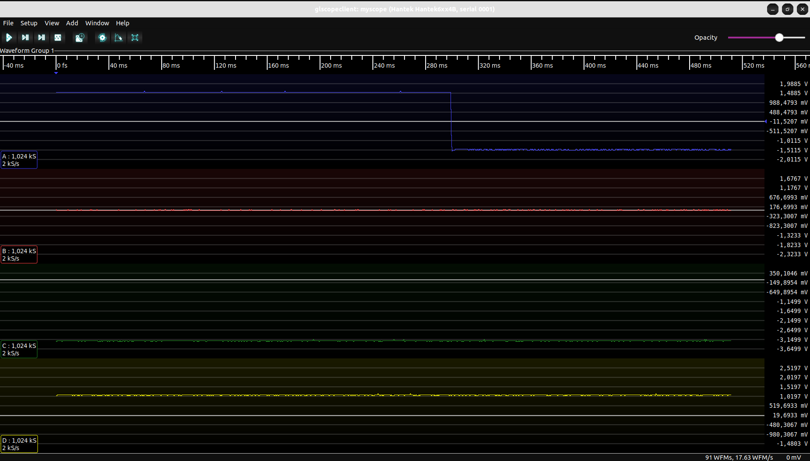

# pyhantek

**experimental** Python driver for Hantek USB oscilloscope 6xx4B

Contributons welcome!

## Running

- clone the repo
- start scopehal-pico bridge
```
python3 scopehal-pico.py
```
- start glscopeclient
```
glscopeclient --debug myscope:pico:lan:127.0.0.1
```

## TODO

- validate device HW/SW version
- add methods for configuring settings

## Screenshot


